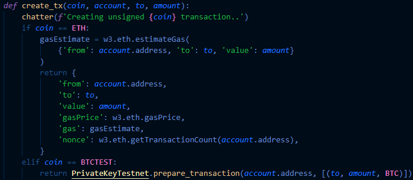

# Homework 19: Multi-Blockchain Wallet in Python

---

## Script Summary
The purpose of this Python script is to build a portfolio management system that can create and manage digital wallets for numerous crypto-assets, as well as conducting transactions across a blockchain network. It utilizes tools such as PHP and hd-wallet-derive along with the Web3 and bit libraries for Python. For demonstration purposes, wallets will be created for the ETH testnet and the BTCTEST testnet; cryptocurrencies transferred in and out of these digital wallets do not hold any monetary value.

---

## Required Installations
The script runs on Python 3.7 and requires the installation of several dependencies and tools. A complete list of these components can be found in the [requirements.txt](requirements.txt) file.

Below are brief instructions on how to install `hd-wallet-derive` and the `bit` and `web3` libraries for Python, with links to guides that provide more in-depth procedures. Within those guides are additional resources that may be used to troubleshoot any issues that occur, or to learn more about the libraries and tools utilized

#### [PHP and hd-wallet-derive](Guidelines/Resources/HD_Wallet_Derive_Install_Guide.md)
Clone the hd-wallet-derive repo (https://github.com/dan-da/hd-wallet-derive).
Open git-bash terminal as Administrator and run the following:

```shell
$ git clone https://github.com/dan-da/hd-wallet-derive
$ cd hd-wallet-derive
$ curl https://getcomposer.org/installer -o installer.php
$ php installer.php
$ php composer.phar install
```

#### [bit and web3.py](Guidelines/Resources/Blockchain_TX_Install_Guide.md)
```shell
$ pip install web3
$ pip install bit
```

---

## Wallet Management
### Generate a Mnemonic Phrase
The 12-word mnemonic used to test the digital wallets was generated from Ian Coleman's [Mnemonic Code Converter](https://iancoleman.io/bip39/), though MyCrypto also has a mnemonic generator built in. The token can be stored in a `.env` file and imported into `wallet.py`.

### Derive the Wallet Keys
#### `derive_wallet` function
This function uses the mnemonic to derive `BIP32` addresses and private keys for Bitcoin, Ethereum, and other altcoins. This function is passed through a dictionary object named `coins` to derive and store the wallet data for both ETH and BTCTEST.


### Linking the Transaction Signing Libraries
#### `priv_key_to_account` function
This function takes the `privkey` string from the derived child key and converts it into an account object.

The addresses, keys, and account objects from the two functions are assigned to variables for ease of use.

#### `create_tx` function
This function creates a raw, unsigned transaction that contains all necessary metadata.


#### `send_tx` function
This function calls `create_tx`, signs the transaction, and then sends it to the designated network.


---

## Transactions
In a git-bash terminal, navigate to the "wallet" directory and enter the commands below to run the script and send a transaction. Note that the script includes a custom function named `chatter` that provides status messages while running the other functions. It will prompt the user to answer '`y"' to disable the feature, or '"n"' to let it continue running.

```shell
$ python
$ from wallet import *
$ {'Disable chatter function? (y/n): '}
$ priv_key_to_account({coin}, {privkey})
$ send_tx({coin}, {account}, {to}, {amount})
```

### Sending an `ETH` Transaction
Before sending any `ETH` transactions, a local node is created using the `geth` and `puppeth` tools from Go Ethereum. The derived wallet address is added to the pre-allocated accounts, which funds the account with test ETH, and the node is re-initialized using the network genesis. Instructions on setting up and running a local node can be found in [this repository](https://github.com/salsal3/hw18-blockchain/blob/main/README.md).

There are a few things to take note of when working with the web.py:
- The first couple of transactions for the wallet should be made in MyCrypto in order to avoid a bug in `web.py`.
- `web.py` automatically converts *ether* into *wei* for many of its methods, including those that check balances and those used for making transactions. Two functions were created to help the user convert between denominations. They are not included in any other functions
  - 1 *ether* = 1e18 *wei* [that is, 1 to the 18th power, or 18 zeros]
  - `no_wei({amount})` converts *ether* to *wei*
  - `yes_wei({amount})` converts *wei* into *ether*
- Running `w3.eth.get_balance({address})` returns the balance in *wei*


In the screenshots below, the functions were entered as follows:
```shell
$ priv_key_to_account(ETH, eth_privkey)
$ send_tx(ETH, eth_account, eth_receiver, 10)
```


The `send_tx` function returns a `txid` that can be used to track the transaction status through MyCrypto.


### Sending a `BTCTEST` Transaction
The `BTCTEST` wallet is funded using a testnet faucet such as [this one](https://testnet-faucet.mempool.co/). Fortunately, no other tools are needed to send BTCTEST transactions over the testnet. The functions were entered as follows:
```shell
$ priv_key_to_account(BTCTEST, btctest_privkey)
$ send_tx(BTCTEST, btctest_account, btctest_receiver, 0.0001)
```


A block explorer like [this one](https://tbtc.bitaps.com/) can be used to track transactions using the account address; it also includes a testnet faucet. The transaction should be almost immediately successful.
